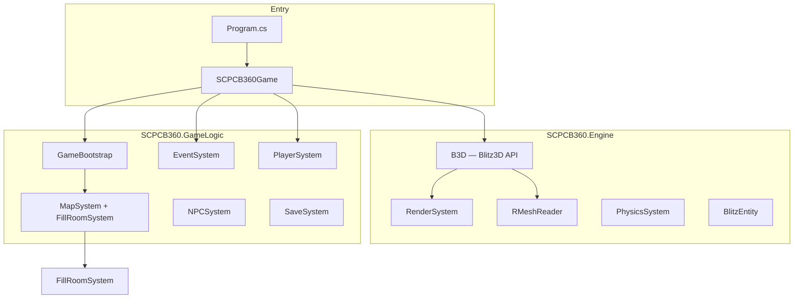

# Architecture

## Overview

The port keeps the original game's **data-driven design**: INI files define rooms, items, and events; procedural map generation places room templates; per-room setup runs through `FillRoom`. The rendering layer replaces Blitz3D with a static `B3D` API backed by MonoGame `GraphicsDevice` and `ContentManager`.

## Namespaces

| Namespace | Role |
|-----------|------|
| `SCPCB360` | `SCPCB360Game` — main `Game` subclass, update/draw loop |
| `SCPCB360.Engine` | Blitz3D compatibility layer, rendering, RMESH, physics |
| `SCPCB360.GameLogic` | Ported game systems (map, NPCs, items, events, UI, save) |
| `SCPCB360.Input` | `XInputRouter` — keyboard/mouse → CB action enum |

All ported sources live under `files/`. The SDK project compiles `**/*.cs` except `xbox/**/*.cs`.

## Boot sequence

1. **`Program.cs`** — constructs `SCPCB360Game`, catches crashes to console.
2. **`Initialize`** — `DifficultySystem`, `AchievementSystem`, `MenuSystem`, `SaveSystem.LoadSaveGames`, `B3D.Initialize`, `RenderSystem.Initialize`, `XInputRouter`.
3. **`LoadContent`** — `TextRenderer`, `GuiSystem`, `BlurFilter`, `PortalRenderer`, `AudioSystem`, `MapAssets`, `DoorSystem`, cameras/player collider.
4. **New game** — `GameBootstrap.InitNewGame()`:
   - Clears rooms, doors, NPCs, events, particles
   - `MapSystem.CreateMap()` or `LoadMap()`
   - `MapSystem.InitWayPoints()`
   - Spawns SCP-173 / SCP-106 off-map
   - `EventSystem.InitEvents()`
   - Places player in `start` or `173` room
5. **Load game** — `GameBootstrap.InitLoadGame()` → `SaveSystem.LoadGame()` recreates rooms via `CreateRoom` (which calls `FillRoom`).

## Entity model

Blitz3D entities are integer handles into a global registry (`B3D`). Each `BlitzEntity` holds:

| Field | Use |
|-------|-----|
| `XnaModel` | MGCB-cooked `.xnb` models (props, NPCs when baked) |
| `RMeshRenderMesh` | Runtime-parsed `.rmesh` visible geometry (rooms) |
| `CollisionMesh` | Triangle mesh from RMESH hidden geometry |
| `Texture` / `PortalTexture` | Runtime or render-target textures |

`RenderSystem` draws `RMeshRenderMesh` surfaces with `BasicEffect` and loads JPEG/PNG textures from disk paths stored in the RMESH.

## Map and rooms

### Room templates (`Data/rooms.ini`)

`RoomTemplateSystem.LoadRoomTemplates()` reads each `[section]`:

- `mesh path` — e.g. `GFX\map\173_opt.rmesh`
- `shape`, `zone1`…`zone5`, `commonness`, flags

`MeshAssetName` is derived from `mesh path` (e.g. `GFX/map/173_opt`) for optional XNB fallback.

### Room creation (`MapSystem.CreateRoom`)

1. Resolve template by name or weighted random for zone + shape.
2. `EnsureTemplateMesh` — load RMESH via `B3D.LoadRMesh`, else `LoadMesh` XNB.
3. `CopyEntity` template mesh, scale by `GameState.RoomScale` (8/2048).
4. Load hidden collision from same `.rmesh` path.
5. `FillRoomSystem.Fill(room)` — doors, objects, NPC slots, room-specific logic.

### Procedural map (`MapSystem.CreateMap`)

Ports the original grid pipeline: hallway grid → shape counts → named rooms → placement → special rooms → overlap prevention → door spawn/link → waypoints.

## Major systems (file map)

| BlitzBasic source | C# files | Notes |
|-------------------|----------|-------|
| `Main.bb` | `SCPCB360Game.cs`, `GameBootstrap.cs`, `GameState.cs`, `PlayerSystem.cs`, `DoorSystem.cs`, `GuiSystem.cs` | Boot, player, doors, HUD |
| `MapSystem.bb` | `MapSystem.cs`, `FillRoomSystem.cs`, `RoomTemplateSystem.cs`, `MapAssets.cs`, `ForestSystem.cs`, `WaypointSystem.cs` | Map gen + per-room fill |
| `UpdateEvents.bb` | `EventSystem.cs` (+ partials) | Event handlers and state machines |
| `NPCs.bb` | `NPCSystem.cs` | NPC types and AI |
| `Items.bb` | `ItemSystem.cs`, `ItemUseSystem.cs`, `ItemTemplateRegistry.cs` | Inventory and templates |
| `Save.bb` | `SaveSystem.cs` | Binary save format compatible with CB |
| `Menu.bb` | `MenuSystem.cs`, `TextRenderer.cs` | Menus and loading screen |
| `LoadAllSounds.bb` / `FMod.bb` | `AudioSystem.cs`, `MusicSystem.cs` | SFX and music |
| `AAText.bb` | `TextRenderer.cs` | Bitmap font rendering |
| `Dreamfilter.bb` | `BlurFilter.cs` | Post-process blur |
| `DrawPortals.bb` | `PortalRenderer.cs` | Pocket dimension portals |
| `Skybox.bb` | `SkyboxSystem.cs` | Sky rendering |
| `Particles.bb` | `ParticleSystem.cs`, `DevilParticleSystem.cs` | Effects |
| Engine | `Blitz3D.cs`, `BlitzEntity.cs`, `RenderSystem.cs`, `RMeshReader.cs`, `PhysicsSystem.cs` | Core engine |

## Game state

`GameState` holds static session fields mirroring CB globals: player entity handles, stamina/blink/sanity, difficulty, screen enum (`MainMenu`, `Loading`, `Playing`, `Paused`, `Dead`), fog, inventory flags, etc.

## Input

`XInputRouter` abstracts platform input into `CBAction` (Forward, Blink, Interact, …). Desktop uses Win32 mouse/keyboard; the same code path is intended for Xbox gamepad on console builds.

## Rendering pipeline (per frame)

1. `RenderSystem.Draw(camera)` — frustum, sort opaque/alpha entities.
2. For each entity: RMESH surfaces **or** `Model.Mesh.Draw()`.
3. `GuiSystem` / `TextRenderer` — 2D HUD via `SpriteBatch`.
4. `BlurFilter` — optional full-screen blur when `GameState.BlurTimer` active.

## Save format

`SaveSystem` reads/writes CB-compatible binary `save.txt` with section markers for NPCs (113), rooms (632), doors (954), decals (1845), etc. Load path recreates the world by calling `MapSystem.CreateRoom` for each saved room, then restores door/NPC/event state.